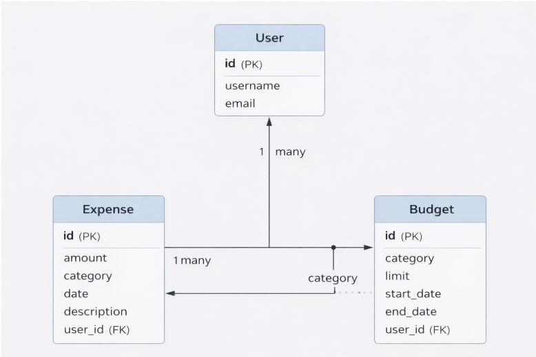
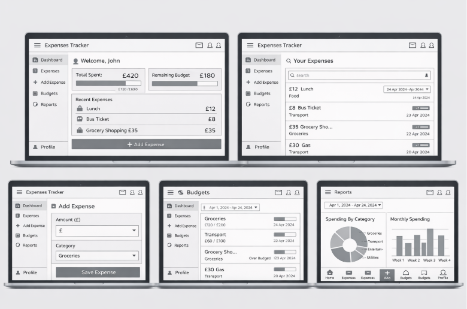
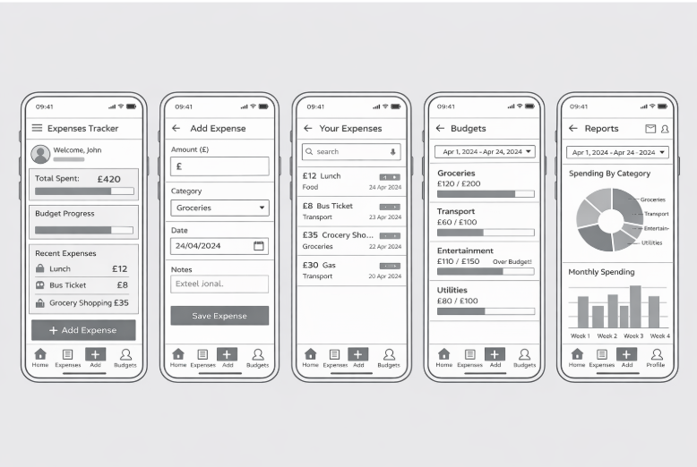
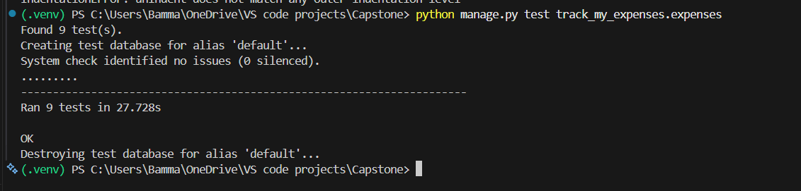
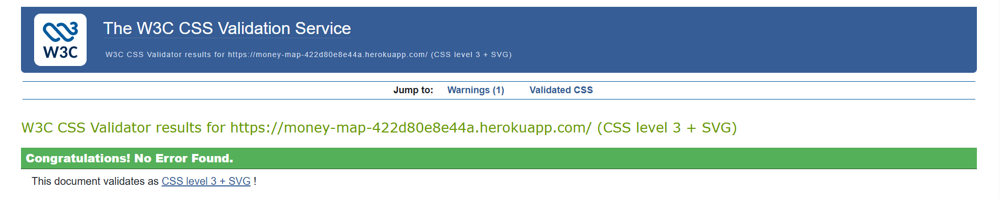
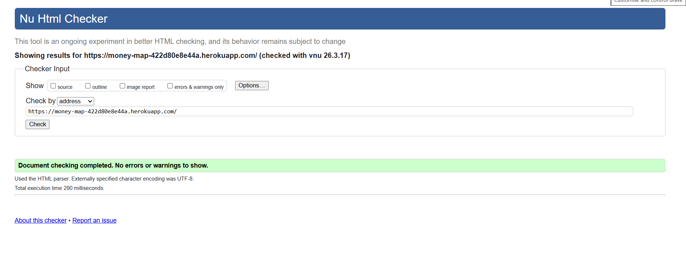

## Introduction

Welcome to Money Map, a comprehensive web application designed to help users efficiently manage their personal finances. This platform enables users to track their income, expenses, and budgets, providing insightful reports and visualizations to support better financial decision-making. Built with Django, Money Map offers a user-friendly interface and robust functionality for both casual users and those seeking advanced budgeting tools.

Money Map features a fully responsive design, ensuring seamless usability across desktops, tablets, and smartphones. The site is fantasy map themed, allowing you to “map” your expenses and budgets in a visually engaging way. More details on the theme will be added soon.

## Features

- **User Authentication**: Secure signup, login, and logout functionality to protect user data and personalize the experience.
- **Dashboard**: An overview of your financial status, including recent expenses, budget summaries, and quick access to key actions.
- **Expense Tracking**: Add, edit, and delete expenses with support for categories, dates, and descriptions. Easily manage your spending history.
- **Budget Management**: Create and manage budgets for different categories. Set monthly limits and monitor your progress.
- **Category Reports**: Generate detailed reports by category to analyze spending patterns and identify areas for improvement.
- **Monthly Reports**: View monthly summaries of your income and expenses, including visual charts for easy interpretation.
- **Account Management**: Update your account information and manage your profile securely.
- **Responsive Design**: The site is optimized for both desktop and mobile devices, ensuring accessibility anywhere.
- **Fantasy Map Theme**: Visualize your financial journey as a map, making expense tracking more engaging and intuitive. (More to come!)
- **Data Backup**: Safeguard your financial data with backup options.
- **Admin Panel**: For site administrators, manage users, categories, and expenses from a dedicated admin interface.

Money Map is designed to make financial tracking simple, insightful, and secure. Whether you want to monitor daily spending or plan for long-term goals, this site provides all the tools you need.

## Project Diagram

The project diagram provides a high-level overview of the application's architecture and main components. It illustrates how different modules interact to deliver a seamless expense tracking experience.

## Wireframes

### Wireframes

	

		
		
Laptop Wireframe

	

	

		
		
Mobile Wireframe

	

The wireframes Above demonstrate the layout and user interface for both desktop and mobile users, highlighting the main navigation, dashboard features, and responsive design.

## AI Assistance

AI (GitHub Copilot) was used extensively throughout the development of Money Map for both code generation and debugging. Copilot provided intelligent code suggestions, helped automate repetitive tasks, and assisted in troubleshooting errors. Every AI-generated code snippet was manually reviewed for accuracy, security, and suitability. When the suggestions met the project’s requirements, they were implemented and saved; otherwise, they were refined or replaced. This collaborative workflow between AI and manual review ensured high-quality, reliable code while accelerating development.

Copilot also contributed to documentation, UI design, and feature planning, making the development process more efficient and creative. All final code and features were carefully checked and tested before deployment.

## Deployment

## CRUD Functionality

Money Map implements full CRUD (Create, Read, Update, Delete) functionality across its core features:

- **Create**: Users can add new expenses and budgets. The platform provides intuitive forms for entering details such as amount, date, description, and category. Categories are predefined and can be selected, but not created by users.
- **Read**: All financial data can be viewed in dashboards, reports, and lists. Users can browse their expenses and budgets, and generate detailed reports for analysis. Categories are available for selection and reporting.
- **Update**: Existing expenses and budgets can be edited. Users can modify details to correct mistakes or adjust their financial plans as needed. Category management (add/edit/delete) is restricted to administrators via the admin panel.

- **Delete**: Users can remove expenses and budgets that are no longer relevant. Deletion is straightforward and helps keep records organized. Categories cannot be deleted by users; this is managed by administrators.

With these features, Money Map empowers users to manage their finances confidently and efficiently, supporting both everyday tracking and long-term planning. The system is designed to be intuitive and secure, so users can focus on their goals without worrying about data management.

## Notifications

Money Map includes a notification system to enhance user experience and provide feedback. Users are notified each time an action is completed, such as:

- Registration (account creation)
- Login (confirmation of successful login)
- Adding an expense (item created)
- Deleting an expense (item deleted)
- Editing an expense or budget

These notifications confirm successful operations and help users stay informed about changes to their financial data. The notification system ensures clarity and transparency throughout the application, making interactions smooth and reassuring.

## Testing

Manual testing was performed throughout the development of Money Map. All core features—including signup, login, logout, adding, editing, and deleting expenses and budgets—were thoroughly tested by hand. Scrollbars and all interactive elements were checked to ensure proper functionality and usability. Every test passed successfully, confirming that the application works as intended across all supported actions and user flows. The manual test cases were derived from the project user stories and acceptance criteria. Each core feature was tested to confirm that it met the expected functional, usability, responsiveness, and data-handling requirements.
All core test cases passed successfully. Minor issues were identified during testing and were resolved prior to final submission.

AI tools such as GitHub Copilot were used to assist in generating Django unit tests. The generated tests were reviewed and adapted to align with the project’s functionality.

*Testing Screenshot: Example of test results and UI validation*

All tests passed successfully, confirming that key features behave as expected.

## Validation

HTML and CSS were validated using W3C validation tools.

	

		
		
CSS Validator Screenshot

	

	

		
		
HTML Validator Screenshot

	

## Agile Methodology

An Agile approach was used throughout the development of this project. The application was developed in iterative stages, focusing on building core functionality first and then gradually adding additional features.

User stories were used to guide development and ensure that all required features were implemented in a structured and user-focused way. These helped prioritise functionality such as expense tracking, editing, deleting, and reporting.

### Iterative Development

The application was continuously tested and improved throughout development. This iterative process allowed for early identification of issues and ensured that the final application met functional and usability requirements.

## Challenges

During development, an attempt was made to implement a custom authentication system. However, this approach introduced complexity and potential security concerns. 
As a result, the decision was made to refactor the authentication system and integrate Django Allauth instead. This improved reliability, reduced development time, and ensured best practices were followed.
This process was challenging but provided valuable insight into authentication workflows and the importance of using established frameworks.

## Future Improvements

- Add functionality for users to upload images of receipts when recording expenses. This would enhance usability by allowing users to keep visual records of their transactions and improve overall expense tracking.